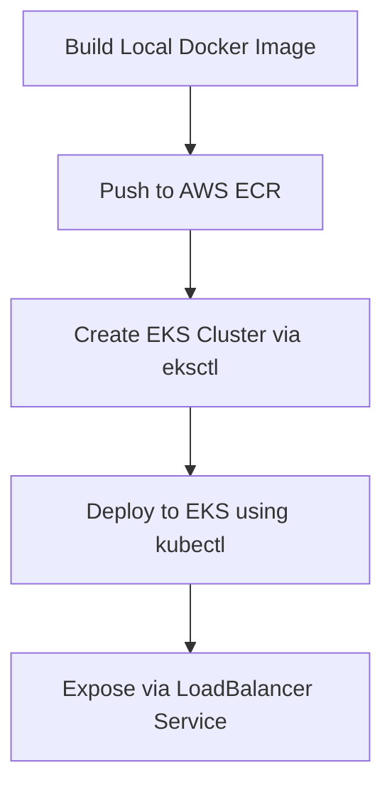

# ☸️ Kubernetes (K8s) Comprehensive Notes & Reference Guide

---

## 📖 Table of Contents
1. [What is Kubernetes (K8s)?](#1-what-is-kubernetes-k8s)
2. [Kubernetes Architecture](#2-kubernetes-architecture)
3. [Core Kubernetes Objects](#3-core-kubernetes-objects)
4. [Declarative Manifests (YAML Files)](#4-declarative-manifests-yaml-files)
   - [Pod Manifest (`pod.yaml`)](#a-pod-manifest-podyaml)
   - [Namespace Manifest (`namespace.yaml`)](#b-namespace-manifest-namespaceyaml)
   - [Deployment Manifest (`deployment.yaml`)](#c-deployment-manifest-deploymentyaml)
   - [Service Manifest (`service.yaml`)](#d-service-manifest-serviceyaml)
5. [Essential & Highlighted `kubectl` Commands](#5-essential--highlighted-kubectl-commands)
   - [Imperative Creation & Exposing Pods](#a-imperative-creation--exposing-pods)
   - [Viewing & Inspecting Resources](#b-viewing--inspecting-resources)
   - [Logs & Debugging](#c-logs--debugging)
   - [Scaling & Image Updates (Zero-Downtime Rollouts)](#d-scaling--image-updates-zero-downtime-rollouts)
   - [Deleting Resources](#e-deleting-resources)
6. [Workload Controllers (DaemonSets)](#6-workload-controllers-daemonsets)
7. [Configuration & Secrets Management](#7-configuration--secrets-management)
8. [Persistent Volumes & Data Persistence (PV & PVC)](#8-persistent-volumes--data-persistence-pv--pvc)
9. [Ingress & Ingress Controllers](#9-ingress--ingress-controllers)
10. [Auto-scaling & Resource Management (HPA, VPA, Requests & Limits)](#10-auto-scaling--resource-management-hpa-vpa-requests--limits)
11. [Security & Access Control (RBAC & Service Accounts)](#11-security--access-control-rbac--service-accounts)
12. [Node Management & Scheduling (Taints & Tolerations)](#12-node-management--scheduling-taints--tolerations)
13. [Deployment Strategies & CI/CD](#13-deployment-strategies--cicd)
14. [Helm (Kubernetes Package Manager)](#14-helm-kubernetes-package-manager)
15. [Cluster Installation & Setup Guides (Kubeadm, Minikube, KIND, EKS)](#15-cluster-installation--setup-guides-kubeadm-minikube-kind-eks)
16. [Monitoring & Observability (Metrics Server & Dashboard)](#16-monitoring--observability-metrics-server--dashboard)
17. [Real-World Applications & Architecture](#17-real-world-applications--architecture)
18. [Interview Questions & Key Answers](#18-interview-questions--key-answers)

---

## 📖 1. What is Kubernetes (K8s)?

**Kubernetes** (often abbreviated as **K8s**, representing the 8 letters between 'K' and 's') is an open-source container orchestration platform designed to automate the deployment, scaling, and management of containerized applications.

### ❓ Why do we need Kubernetes?

While Docker allows you to package and run an application inside a container, managing thousands of containers across multiple servers manually is nearly impossible. Kubernetes solves this by providing:

- **Self-Healing**: Automatically restarts failed containers, replaces containers, and terminates containers that don’t respond to user-defined health checks.
- **Auto-Scaling**: Automatically scales your container count up or down based on CPU/memory usage.
- **Load Balancing**: Distributes network traffic across containers to ensure stability.
- **Automated Rollouts & Rollbacks**: Deploy new versions of your application without downtime. If something goes wrong, it automatically rolls back to the previous stable state.
- **Service Discovery**: Easily lets containers discover and communicate with each other.

---

## 🏗️ 2. Kubernetes Architecture

Kubernetes follows a **Control Plane (Master Node) & Worker Node** architecture.

```mermaid
graph TD
    subgraph Control Plane (Master Node)
        API[API Server - kube-apiserver]
        ETCD[(etcd Database)]
        SCH[Scheduler - kube-scheduler]
        CM[Controller Manager - kube-controller-manager]
    end

    subgraph Worker Node 1
        KLT1[Kubelet]
        KPX1[Kube-Proxy]
        POD1[Pod]
    end

    subgraph Worker Node 2
        KLT2[Kubelet]
        KPX2[Kube-Proxy]
        POD2[Pod]
    end

    API --> ETCD
    API --> SCH
    API --> CM
    API --> KLT1
    API --> KLT2
    KPX1 -.-> POD1
    KPX2 -.-> POD2
```

### A. Control Plane (Master Node)
The brain of the cluster, responsible for making global decisions (like scheduling) and detecting/responding to cluster events.

1. **API Server (`kube-apiserver`)**: The entry point for all commands (via `kubectl` or API requests). Every component communicates through the API Server.
2. **etcd**: A highly available, distributed key-value store that holds the complete configuration and state of the cluster.
3. **Scheduler (`kube-scheduler`)**: Watches for newly created Pods and assigns them to optimal Worker Nodes based on resources (CPU, Memory).
4. **Controller Manager (`kube-controller-manager`)**: Runs background controllers to maintain the cluster state (e.g., Node Controller, Replication Controller).

### B. Worker Nodes
The machines (VMs or physical servers) where your application containers actually run.

1. **Kubelet**: An agent running on each worker node. It ensures that containers are running in a Pod as described in the manifest.
2. **Kube-Proxy (`kube-proxy`)**: Manages network routing rules on nodes to enable communication inside and outside the cluster.
3. **Container Runtime**: The software responsible for running containers (e.g., `containerd`, `CRI-O`, or `Docker`).

---

## 🗂️ 3. Core Kubernetes Objects

| Object | Description |
| :--- | :--- |
| **Pod** | The smallest deployable unit in Kubernetes. Contains one or more containers sharing network and storage. |
| **ReplicaSet** | Ensures a specified number of identical Pod replicas are running at any given time. |
| **Deployment** | Manages ReplicaSets and Pods. Supports declarative updates (rolling updates/rollbacks). |
| **Service** | Defines a logical set of Pods and a policy to access them (LoadBalancer, NodePort, ClusterIP). |
| **Namespace** | Virtual clusters inside a physical cluster to isolate resources (e.g., `dev`, `staging`, `prod`). |
| **DaemonSet** | Ensures that a copy of a Pod runs on all (or selected) worker nodes. |
| **Ingress** | HTTP/HTTPS router managing external access to services inside the cluster. |
| **ConfigMap / Secret** | Stores non-confidential configuration or encrypted sensitive data (passwords/keys). |
| **PV / PVC** | Persistent storage resources for retaining data across container restarts. |

---

## 📄 4. Declarative Manifests (YAML Files)

Kubernetes objects are created using YAML configurations. Every manifest has four mandatory root fields:
1. `apiVersion`: Which version of the Kubernetes API to use.
2. `kind`: The type of object you want to create (e.g., `Pod`, `Deployment`, `Service`).
3. `metadata`: Data identifying the object (`name`, `labels`, `namespace`).
4. `spec`: The desired state or configuration of the object.

### A. Pod Manifest (`pod.yaml`)
A single NGINX pod manifest with resource requests & limits and liveness/readiness health probes:

```yaml
apiVersion: v1
kind: Pod
metadata:
  name: nginx-pod
  namespace: default
  labels:
    app: nginx-web
spec:
  containers:
  - name: nginx-container
    image: nginx:1.25.4-alpine
    ports:
    - containerPort: 80
    resources:
      requests:
        cpu: "100m"      # Guaranteed 0.1 CPU core
        memory: "128Mi"  # Guaranteed 128 MB RAM
      limits:
        cpu: "500m"      # Maximum 0.5 CPU core
        memory: "256Mi"  # Maximum 256 MB RAM
    livenessProbe:
      httpGet:
        path: /
        port: 80
      initialDelaySeconds: 15
      periodSeconds: 20
    readinessProbe:
      httpGet:
        path: /
        port: 80
      initialDelaySeconds: 5
      periodSeconds: 10
```

### B. Namespace Manifest (`namespace.yaml`)
Isolates environments within the cluster:

```yaml
apiVersion: v1
kind: Namespace
metadata:
  name: production
  labels:
    environment: production
```

### C. Deployment Manifest (`deployment.yaml`)
Deploys 3 replicas of NGINX with zero-downtime rolling update strategy:

```yaml
apiVersion: apps/v1
kind: Deployment
metadata:
  name: nginx-deployment
  namespace: production
  labels:
    app: nginx
spec:
  replicas: 3
  strategy:
    type: RollingUpdate
    rollingUpdate:
      maxSurge: 1
      maxUnavailable: 0
  selector:
    matchLabels:
      app: nginx
  template:
    metadata:
      labels:
        app: nginx
    spec:
      containers:
      - name: nginx
        image: nginx:1.25.4-alpine
        ports:
        - containerPort: 80
        resources:
          requests:
            cpu: "100m"
            memory: "128Mi"
          limits:
            cpu: "500m"
            memory: "256Mi"
```

### D. Service Manifest (`service.yaml`)
Exposes NGINX pods to internal or external traffic:

```yaml
apiVersion: v1
kind: Service
metadata:
  name: nginx-service
  namespace: production
spec:
  type: ClusterIP   # Options: ClusterIP (Internal), NodePort, LoadBalancer
  selector:
    app: nginx      # Matches Pods with label "app: nginx"
  ports:
  - protocol: TCP
    port: 80        # Service port
    targetPort: 80  # Container port
```

---

## 🛠️ 5. Essential & Highlighted `kubectl` Commands

`kubectl` is the command-line tool used to control Kubernetes clusters.

### A. Imperative Creation & Exposing Pods

```bash
# 🔹 Create a Deployment directly (Imperative)
kubectl create deployment my-app --image=nginx:1.25.4-alpine

# 🔹 Create a Pod directly
kubectl run nginx-pod --image=nginx:1.25.4-alpine --port=80

# 🔹 Expose Deployment as a Service (NodePort or LoadBalancer)
kubectl expose deployment my-app --port=80 --target-port=80 --type=NodePort

# 🔹 Get URL for exposed service on Minikube
minikube service my-app --url
```

### B. Viewing & Inspecting Resources

```bash
# 🔹 List all Pods in the default namespace
kubectl get pods

# 🔹 List all Pods with details (IP address, Node name)
kubectl get pods -o wide

# 🔹 Watch Pod creation in real-time
kubectl get pods -w

# 🔹 List resources across ALL namespaces
kubectl get pods -A
kubectl get svc -A
kubectl get all -n production

# 🔹 Describe detailed metadata & events of a Pod (Great for debugging!)
kubectl describe pod <pod-name>
```

### C. Logs & Debugging

```bash
# 🔹 View application logs of a Pod
kubectl logs <pod-name>

# 🔹 Follow/stream live logs from a Pod
kubectl logs -f <pod-name> --tail=50

# 🔹 Open an interactive shell inside a running Pod container
kubectl exec -it <pod-name> -- /bin/sh

# 🔹 Forward local port 8080 to Pod port 80
kubectl port-forward pod/<pod-name> 8080:80
```

### D. Scaling & Image Updates (Zero-Downtime Rollouts)

```bash
# 🔹 Scale Deployment replicas up or down
kubectl scale deployment my-app --replicas=5

# 🔹 Update container image (Trigger Rolling Update)
kubectl set image deployment/my-app nginx=nginx:1.25.5-alpine

# 🔹 Check status of rolling update
kubectl rollout status deployment/my-app

# 🔹 View deployment revision history
kubectl rollout history deployment/my-app

# 🔹 Roll back to previous working version if update fails
kubectl rollout undo deployment/my-app

# 🔹 Roll back to a specific revision number
kubectl rollout undo deployment/my-app --to-revision=2
```

### E. Deleting Resources

```bash
# 🔹 Delete resource via YAML manifest
kubectl delete -f deployment.yaml

# 🔹 Delete a specific Pod
kubectl delete pod <pod-name>

# 🔹 Delete a Deployment and its associated Pods
kubectl delete deployment my-app
```

---

## 🔄 6. Workload Controllers (DaemonSets)

A **DaemonSet** ensures that all (or specific) worker nodes run a copy of a Pod. As nodes join the cluster, Pods are automatically added to them.

### Use Cases:
- Cluster monitoring agents (`prometheus-node-exporter`).
- Log collection daemons (`fluentbit`, `fluentd`).
- Networking plugins (`calico`, `cilium`).

### DaemonSet Manifest (`daemonset.yaml`):

```yaml
apiVersion: apps/v1
kind: DaemonSet
metadata:
  name: fluentbit-logging
  namespace: kube-system
spec:
  selector:
    matchLabels:
      name: fluentbit
  template:
    metadata:
      labels:
        name: fluentbit
    spec:
      containers:
      - name: fluentbit
        image: fluent/fluent-bit:2.2.0
        resources:
          limits:
            memory: 200Mi
          requests:
            cpu: 100m
            memory: 100Mi
```

---

## ⚡ 7. Configuration & Secrets Management

Decouple configuration parameters and sensitive credentials from container images.

### A. ConfigMap (`configmap.yaml`)
Stores non-confidential configuration parameters in key-value pairs:

```yaml
apiVersion: v1
kind: ConfigMap
metadata:
  name: app-config
  namespace: default
data:
  DB_HOST: "mysql-service"
  APP_ENV: "production"
```

### B. Secret (`secret.yaml`)
Stores passwords, API tokens, and TLS certificates encoded in base64:

```yaml
apiVersion: v1
kind: Secret
metadata:
  name: db-secret
  namespace: default
type: Opaque
stringData:
  DB_PASSWORD: "SuperSecretPassword123!"
```

### Useful Commands:
```bash
# 🔹 Create ConfigMap from CLI
kubectl create configmap app-config --from-literal=DB_HOST=mysql-service

# 🔹 Create Secret from CLI
kubectl create secret generic db-secret --from-literal=DB_PASSWORD=SuperSecret123!
```

---

## 💾 8. Persistent Volumes & Data Persistence (PV & PVC)

Pods are temporary (ephemeral). If a database pod restarts, its internal disk is wiped clean. Persistent Storage solves this.

- **PersistentVolume (PV)**: Cluster-level storage resource provisioned manually or dynamically.
- **PersistentVolumeClaim (PVC)**: Storage request submitted by a Pod.

```yaml
apiVersion: v1
kind: PersistentVolumeClaim
metadata:
  name: mysql-pvc
spec:
  accessModes:
    - ReadWriteOnce
  resources:
    requests:
      storage: 10Gi
```

---

## 🌐 9. Ingress & Ingress Controllers

### ❓ What is Ingress?
**Ingress** acts as a smart entry gateway / router for your Kubernetes cluster. It exposes HTTP and HTTPS routes from outside the cluster to internal Services based on domain names (`example.com`) or path rules (`/api`).

```
Internet --> [ Ingress Controller ] --> Ingress Rules --> Service --> Pods
```

### Setup Ingress Controller via Helm:

```bash
# 🔹 Add NGINX Ingress Repository
helm repo add ingress-nginx https://kubernetes.github.io/ingress-nginx
helm repo update

# 🔹 Install Ingress Controller
helm install ingress-nginx ingress-nginx/ingress-nginx
```

### Ingress Manifest (`ingress.yaml`):

```yaml
apiVersion: networking.k8s.io/v1
kind: Ingress
metadata:
  name: web-ingress
  annotations:
    nginx.ingress.kubernetes.io/ssl-redirect: "false"
spec:
  rules:
  - host: myapp.local
    http:
      paths:
      - path: /
        pathType: Prefix
        backend:
          service:
            name: nginx-service
            port:
              number: 80
```

---

## 📈 10. Auto-scaling & Resource Management (HPA, VPA, Requests & Limits)

### A. Resource Requests & Limits
- **Requests**: Guaranteed resource allocation needed for scheduling.
- **Limits**: Maximum ceiling allowed before CPU throttling or OOM (Out Of Memory) Pod termination.

### B. Horizontal Pod Autoscaler (HPA)
Automatically increases or decreases the number of Pod replicas based on CPU or Memory usage.

```bash
# 🔹 Enable HPA imperatively (Target 70% CPU usage, 2 to 10 replicas)
kubectl autoscale deployment nginx-deployment --cpu-percent=70 --min=2 --max=10
```

#### HPA Manifest (`hpa.yaml`):

```yaml
apiVersion: autoscaling/v2
kind: HorizontalPodAutoscaler
metadata:
  name: nginx-hpa
spec:
  scaleTargetRef:
    apiVersion: apps/v1
    kind: Deployment
    name: nginx-deployment
  minReplicas: 2
  maxReplicas: 10
  metrics:
  - type: Resource
    resource:
      name: cpu
      target:
        type: Utilization
        averageUtilization: 70
```

### C. Vertical Pod Autoscaler (VPA)
Automatically adjusts container CPU and Memory requests/limits based on actual historical usage.

```yaml
apiVersion: autoscaling.k8s.io/v1
kind: VerticalPodAutoscaler
metadata:
  name: nginx-vpa
spec:
  targetRef:
    apiVersion: apps/v1
    kind: Deployment
    name: nginx-deployment
  updatePolicy:
    updateMode: "Auto"
```

---

## 🔐 11. Security & Access Control (RBAC & Service Accounts)

**Role-Based Access Control (RBAC)** regulates access to cluster resources based on roles.

- **ServiceAccount**: Identity given to Pods to interact with the K8s API server.
- **Role**: Namespaced set of permissions (`get`, `list`, `create`, `delete` on `pods`).
- **RoleBinding**: Connects a Role to a ServiceAccount or User.

### RBAC Manifest (`rbac.yaml`):

```yaml
apiVersion: v1
kind: ServiceAccount
metadata:
  name: pod-reader-sa
  namespace: default
---
apiVersion: rbac.authorization.k8s.io/v1
kind: Role
metadata:
  name: pod-reader-role
  namespace: default
rules:
- apiGroups: [""]
  resources: ["pods"]
  verbs: ["get", "list", "watch"]
---
apiVersion: rbac.authorization.k8s.io/v1
kind: RoleBinding
metadata:
  name: read-pods-binding
  namespace: default
subjects:
- kind: ServiceAccount
  name: pod-reader-sa
  namespace: default
roleRef:
  kind: Role
  name: pod-reader-role
  apiGroup: rbac.authorization.k8s.io
```

---

## 🚫 12. Node Management & Scheduling (Taints & Tolerations)

- **Taint**: Applied to a **Node** to repel Pods from scheduling on it unless they carry a matching toleration.
- **Toleration**: Applied to a **Pod** allowing it to schedule on tainted nodes.

### Useful Commands:
```bash
# 🔹 Add Taint to Node (Pods won't schedule unless they tolerate gpu=true)
kubectl taint nodes node1 dedicated=gpu:NoSchedule

# 🔹 Remove Taint from Node
kubectl taint nodes node1 dedicated=gpu:NoSchedule-
```

### Toleration Pod Spec (`toleration-pod.yaml`):

```yaml
apiVersion: v1
kind: Pod
metadata:
  name: gpu-pod
spec:
  containers:
  - name: cuda-container
    image: nvidia/cuda:12.0.0-base-ubuntu22.04
  tolerations:
  - key: "dedicated"
    operator: "Equal"
    value: "gpu"
    effect: "NoSchedule"
```

---

## 🚀 13. Deployment Strategies & CI/CD

| Strategy | Downtime | Description |
| :--- | :--- | :--- |
| **Rolling Update** | Zero | Replaces old pods with new pods incrementally. (K8s Default) |
| **Recreate** | Yes | Kills all old pods first before starting new pods. |
| **Blue-Green** | Zero | Deploys 2 identical environments (Blue & Green), switches service selector. |
| **Canary** | Zero | Sends 10% of traffic to new version (Canary) to test stability before full rollout. |

### CI/CD Pipeline Flow with K8s:
1. Developer pushes code to GitHub.
2. CI tool (GitHub Actions / GitLab CI) runs tests, builds Docker image, and scans for vulnerabilities.
3. Image pushed to Docker Hub / AWS ECR.
4. CD tool (ArgoCD / Helm) updates deployment manifest tags and applies changes cleanly to Kubernetes.

---

## ⚓ 14. Helm (Kubernetes Package Manager)

### ❓ What is Helm?
**Helm** is the official package manager for Kubernetes. Just as `apt` is for Ubuntu, `yum` is for RHEL, or `npm` is for Node.js, Helm simplifies how you define, install, upgrade, and manage applications in a Kubernetes cluster using pre-packaged resource bundles called **Helm Charts**.

### 🛠️ Essential Helm Commands:

```bash
# 🔹 Add a repository
helm repo add bitnami https://charts.bitnami.com/bitnami
helm repo update

# 🔹 Install a chart
helm install my-release bitnami/nginx

# 🔹 Upgrade a chart
helm upgrade my-release bitnami/nginx -f custom-values.yaml

# 🔹 Rollback release to revision 1
helm rollback my-release 1

# 🔹 List releases
helm list -A
```

---

## 🚀 15. Cluster Installation & Setup Guides (Kubeadm, Minikube, KIND, EKS)

### A. Minikube (Local Single-Node Cluster)
```bash
# 🔹 Start Minikube
minikube start --driver=docker --cpus=4 --memory=8192

# 🔹 Enable Addons
minikube addons enable ingress
minikube addons enable metrics-server
```

### B. KIND (Kubernetes in Docker - Multi-Node)
```bash
# 🔹 Create cluster with KIND
kind create cluster --name dev-cluster
```

### C. AWS EKS Deployment (Step-by-Step Guide)



```bash
# 1. Create ECR Repository
aws ecr create-repository --repository-name my-web-app --region us-east-1

# 2. Docker Login to ECR
aws ecr get-login-password --region us-east-1 | docker login --username AWS --password-stdin <AWS_ACCOUNT_ID>.dkr.ecr.us-east-1.amazonaws.com

# 3. Build, Tag & Push Docker Image
docker build -t my-web-app .
docker tag my-web-app:latest <AWS_ACCOUNT_ID>.dkr.ecr.us-east-1.amazonaws.com/my-web-app:latest
docker push <AWS_ACCOUNT_ID>.dkr.ecr.us-east-1.amazonaws.com/my-web-app:latest

# 4. Spin up EKS Cluster via eksctl
eksctl create cluster \
  --name my-eks-cluster \
  --region us-east-1 \
  --nodegroup-name standard-workers \
  --node-type t3.medium \
  --nodes 3 \
  --managed

# 5. Apply Deployment & LoadBalancer Service
kubectl apply -f eks-app.yaml
```

---

## 📊 16. Monitoring & Observability (Metrics Server & Dashboard)

### A. Metrics Server
Required for `kubectl top` commands and Horizontal Pod Autoscaling (HPA).

```bash
# 🔹 Deploy Metrics Server
kubectl apply -f https://github.com/kubernetes-sigs/metrics-server/releases/latest/download/components.yaml

# 🔹 Check CPU and Memory consumption
kubectl top nodes
kubectl top pods
```

### B. Kubernetes Dashboard
Web-based UI for managing Kubernetes resources.

```bash
# 🔹 Deploy Dashboard
kubectl apply -f https://raw.githubusercontent.com/kubernetes/dashboard/v2.7.0/aio/deploy/recommended.yaml

# 🔹 Generate bearer token for login
kubectl -n kubernetes-dashboard create token admin-user

# 🔹 Start Proxy server locally
kubectl proxy
```

---

## 🏢 17. Real-World Applications & Architecture

### Complete Multi-Tier Application Architecture:
- **Frontend**: NGINX Web Server (`Deployment` + `LoadBalancer Service`).
- **Backend**: Node.js/Python API (`Deployment` + `ClusterIP Service`).
- **Database**: MySQL/PostgreSQL (`StatefulSet` + `PVC` + `Secret` + `ConfigMap` + `Headless Service`).

---

## ❓ 18. Interview Questions & Key Answers

#### Q1: What is the main role of `etcd` in Kubernetes?
**Answer**: `etcd` is a distributed, consistent key-value store that serves as the single source of truth for all cluster configuration and state data.

#### Q2: What is the difference between `Deployment` and `StatefulSet`?
**Answer**: Deployments manage **stateless** applications with interchangeable pods and random IDs. StatefulSets manage **stateful** applications with unique, ordered, sticky pod identities (`mysql-0`, `mysql-1`) and dedicated storage claims.

#### Q3: What happens when a Pod's Memory exceeds its defined `limit`?
**Answer**: The container is immediately terminated by the Linux kernel OOM (Out Of Memory) Killer with exit code 137, and `kubelet` restarts it.

#### Q4: What is the difference between `ClusterIP`, `NodePort`, and `LoadBalancer`?
**Answer**:
- `ClusterIP`: Internal-only IP accessible inside the cluster.
- `NodePort`: Exposes service on a static port (30000-32767) on all node IP addresses.
- `LoadBalancer`: Provisions a cloud provider's external load balancer (e.g. AWS ALB/ELB).
