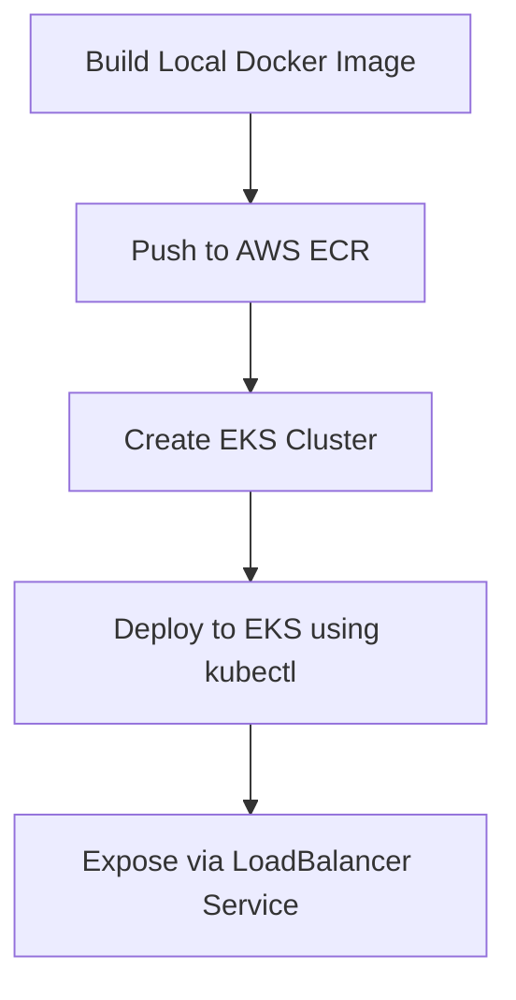

# ☸️ Kubernetes (K8s) Comprehensive Notes

---

## 📖 1. What is Kubernetes (K8s)?

**Kubernetes** (often abbreviated as **K8s**, representing the 8 letters between 'K' and 's') is an open-source container orchestration platform designed to automate the deployment, scaling, and management of containerized applications.

### ❓ Why do we need Kubernetes?

While Docker allows you to package and run an application inside a container, managing thousands of containers across multiple servers manually is nearly impossible. Kubernetes solves this by providing:

- **Self-Healing**: Automatically restarts failed containers, replaces containers, and terminates containers that don’t respond to user-defined health checks.
- **Auto-Scaling**: Automatically scales your container count up or down based on CPU/memory usage.
- **Load Balancing**: Distributes network traffic across containers to ensure stability.
- **Automated Rollouts & Rollbacks**: Deploy new versions of your application without downtime. If something goes wrong, it automatically rolls back to the previous stable state.
- **Service Discovery**: Easily lets containers discover and communicate with each other.

---

## 🏗️ 2. Kubernetes Architecture

Kubernetes follows a **Master-Worker** architecture.

```mermaid
graph TD
    subgraph Control Plane (Master Node)
        API[API Server]
        ETCD[(etcd Database)]
        SCH[Scheduler]
        CM[Controller Manager]
    end

    subgraph Worker Node 1
        KLT1[Kubelet]
        KPX1[Kube-Proxy]
        POD1[Pod]
    end

    subgraph Worker Node 2
        KLT2[Kubelet]
        KPX2[Kube-Proxy]
        POD2[Pod]
    end

    API --> ETCD
    API --> SCH
    API --> CM
    API --> KLT1
    API --> KLT2
    KPX1 -.-> POD1
    KPX2 -.-> POD2
```

### A. Control Plane (Master Node)

The brain of the cluster, responsible for making global decisions (like scheduling) and detecting/responding to cluster events.

1.  **API Server (`kube-apiserver`)**: The entry point for all commands (via `kubectl` or API requests). Every component communicates through the API Server.
2.  **etcd**: A highly available, distributed key-value store that holds the complete configuration and state of the cluster.
3.  **Scheduler (`kube-scheduler`)**: Watches for newly created Pods and assigns them to optimal Worker Nodes based on resources (CPU, Memory).
4.  **Controller Manager (`kube-controller-manager`)**: Runs background controllers to maintain the cluster state (e.g., Node Controller, Replication Controller).

### B. Worker Nodes

The machines (VMs or physical servers) where your application containers actually run.

1.  **Kubelet**: An agent running on each worker node. It ensures that containers are running in a Pod as described in the manifest.
2.  **Kube-Proxy (`kube-proxy`)**: Manages network routing rules on nodes to enable communication inside and outside the cluster.
3.  **Container Runtime**: The software responsible for running containers (e.g., `containerd`, `CRI-O`, or `Docker`).

---

## 🗂️ 3. Core Kubernetes Objects

| Object         | Description                                                                                                               |
| :------------- | :------------------------------------------------------------------------------------------------------------------------ |
| **Pod**        | The smallest deployable unit in Kubernetes. Contains one or more containers (usually one) that share storage and network. |
| **ReplicaSet** | Ensures that a specified number of Pod replicas are running at any given time.                                            |
| **Deployment** | A higher-level object that manages ReplicaSets and Pods. Supports declarative updates (rolling updates/rollbacks).        |
| **Service**    | Defines a logical set of Pods and a policy to access them (Load Balancer, internal IP, etc.).                             |
| **Namespace**  | Virtual clusters inside a physical cluster to isolate resources (e.g., `dev`, `staging`, `prod`).                         |

---

## Creation of Pods

Pods is a single instance of running process in cluster.
It can run one or more container and share the shame resources.

> To create a pod use the command =>

# kubectl create deployment <image-name > --image=<dockerhub-image>:<tag(optional)>

eg> kubectl create deployment my-app --image=nginx

> To see the state and status of pods use command =>

# kubectl get pods

## Exposing pod to access it

=> Since our app is running in the container which is running inside pod which is running inside cluster ,
=> to expose it, we use the commands =>

# i) kubectl expose deployment <created app name> --port=<port> --type=<type of app eg. loadbalancer>

# ii) minikube get services

command 2 will give you a url for that container

## Checking the running services

=> To check the running services in k8s we use command =>

# kubectl get services

## To check the logs

=> To check the logs/info we use the command =>

# i) kubectl logs <pods name with id>

# ii) kubectl describe pods

[IMPORTANT]

> Let's say our website it running and we made some changes and create a new docker image and want to make it live , but it could lead to downtime for our website to deal with we use k8s .
> K8S make old website live until , our new docker container full executable and after it automatically terminate the old one

# commands used for this

# kubectl set image deployments <name of running web app> <name of new image's container>=<new docker image>

# How to handle Error in deployment

Let's at the time of deploying another docker image , some error happens , then k8s keep running the previous container and waiting for new one , since new one is corrupted , it will be never fetched
to handle this we rollout our changes

> following commands are used to do so

# kubectl rollout status deployment <name of deployed app>

# kubectl rollout undo deployment <name of deployed app>

## Scaling in kubernetes

> We can create multiple instance of one docker container using k8s
> scaling has two main benefits
> i) It prevents down time
> ii) Manage trafic properly
> => To scale , we use the command =>

# kubectl scale deployment <name of deployed app> --replicas=<number>

> If you want to increase/decrease replicas use same command and change no

## 📄 4. Declarative Manifests (YAML)

Kubernetes objects are created using YAML configurations. Every manifest has four mandatory root fields:

1.  `apiVersion`: Which version of the Kubernetes API to use.
2.  `kind`: The type of object you want to create (e.g., `Pod`, `Deployment`, `Service`).
3.  `metadata`: Data that helps uniquely identify the object (e.g., `name`, `labels`, `namespace`).
4.  `spec`: The desired state or configuration of the object.

### Example: Deployment Manifest (`deployment.yaml`)

This deploys 3 replicas of an Nginx web server container:

```yaml
apiVersion: apps/v1
kind: Deployment
metadata:
  name: nginx-deployment
  labels:
    app: nginx
spec:
  replicas: 3
  selector:
    matchLabels:
      app: nginx
  template:
    metadata:
      labels:
        app: nginx
    spec:
      containers:
        - name: nginx
          image: nginx:1.21.6
          ports:
            - containerPort: 80
```

### Example: Service Manifest (`service.yaml`)

Exposes the above Nginx deployment internally or externally:

```yaml
apiVersion: v1
kind: Service
metadata:
  name: nginx-service
spec:
  selector:
    app: nginx # Targets Pods with label "app: nginx"
  ports:
    - protocol: TCP
      port: 80 # Port exposed by the Service
      targetPort: 80 # Port running inside the Pod
  type: ClusterIP # Internal-only IP (default)
```

---

## 🛠️ 5. Essential `kubectl` Commands

`kubectl` is the command-line interface for running commands against Kubernetes clusters.

### A. Creating & Applying Resources

```bash
# Apply a YAML file to create/update resources
kubectl apply -f <deployment file name.yaml>

# Create resources directly (imperative)
kubectl create namespace development
```

### B. Viewing Status (Get)

```bash
# List all Pods in the default namespace
kubectl get pods

# List all Pods with detailed info (IPs, Nodes)
kubectl get pods -o wide

# Watch Pod changes in real-time
kubectl get pods -w

# Get all Deployments
kubectl get deployments

# Get all Services
kubectl get services
```

### C. Troubleshooting & Logs

```bash
# Describe detailed status of a specific Pod
kubectl describe pod <pod-name>

# View logs of a running container in a Pod
kubectl logs <pod-name>

# Stream logs of a running container in real-time
kubectl logs -f <pod-name>

# Access terminal inside a running container
kubectl exec -it <pod-name> -- /bin/bash
```

### D. Deleting Resources

```bash
# Delete resource using a YAML file
kubectl delete -f deployment.yaml

# Delete a specific Pod
kubectl delete pod <pod-name>
```

---

## Running multiple containers using kubernetes

> To run multiple containers , we can use two methods
> i) running all containers in single pod
> ii) running all contaiers in different-2 pods (recommended)

## 🚀 6. Deploying on AWS EKS (Elastic Kubernetes Service)

Here is a step-by-step guide to deploying a custom Dockerized application onto AWS EKS.



### Prerequisites

Make sure you have the following CLI tools installed:

1.  **AWS CLI**: `aws configure` (logged in with sufficient IAM permissions).
2.  **eksctl**: Official CLI tool for creating and managing EKS clusters.
3.  **kubectl**: Kubernetes command line tool.

---

### Step 1: Create an ECR (Elastic Container Registry) & Push your Docker Image

Before EKS can download your image, it must be hosted in a registry like AWS ECR.

```bash
# 1. Create a repository on ECR
aws ecr create-repository --repository-name my-web-app --region us-east-1

# 2. Login Docker to your ECR registry (replace AWS Account ID)
aws ecr get-login-password --region us-east-1 | docker login --username AWS --password-stdin <AWS_ACCOUNT_ID>.dkr.ecr.us-east-1.amazonaws.com

# 3. Build your local Docker image
docker build -t my-web-app .

# 4. Tag the image for ECR
docker tag my-web-app:latest <AWS_ACCOUNT_ID>.dkr.ecr.us-east-1.amazonaws.com/my-web-app:latest

# 5. Push the image to AWS ECR
docker push <AWS_ACCOUNT_ID>.dkr.ecr.us-east-1.amazonaws.com/my-web-app:latest
```

---

### Step 2: Create the EKS Cluster

Use `eksctl` to quickly spin up a production-ready Kubernetes cluster on AWS.

```bash
eksctl create cluster \
  --name my-eks-cluster \
  --region us-east-1 \
  --nodegroup-name standard-workers \
  --node-type t3.medium \
  --nodes 3 \
  --nodes-min 1 \
  --nodes-max 4 \
  --managed
```

> [!NOTE]
> This command will automatically set up VPC, subnets, Security Groups, EC2 Worker Nodes, and configure your local `kubectl` to point to the new cluster. This process takes 15–20 minutes.

Verify cluster connection:

```bash
kubectl get nodes
```

---

### Step 3: Write EKS Deployment & Service Manifests

Create a manifest file named `eks-app.yaml`:

```yaml
apiVersion: apps/v1
kind: Deployment
metadata:
  name: my-app-deployment
  labels:
    app: my-app
spec:
  replicas: 2
  selector:
    matchLabels:
      app: my-app
  template:
    metadata:
      labels:
        app: my-app
    spec:
      containers:
        - name: my-app-container
          # Reference the image we pushed to ECR:
          image: <AWS_ACCOUNT_ID>.dkr.ecr.us-east-1.amazonaws.com/my-web-app:latest
          ports:
            - containerPort: 8080
---
apiVersion: v1
kind: Service
metadata:
  name: my-app-service
spec:
  selector:
    app: my-app
  ports:
    - protocol: TCP
      port: 80
      targetPort: 8080
  # LoadBalancer type provisions an AWS Classic/Application Load Balancer (ALB)
  type: LoadBalancer
```

---

### Step 4: Apply to EKS Cluster

Deploy the application and service onto your cluster:

```bash
kubectl apply -f eks-app.yaml
```

Check the status of your pods:

```bash
kubectl get pods
```

---

### Step 5: Get Public Load Balancer URL

Because the service type is `LoadBalancer`, AWS automatically spins up a cloud load balancer.

```bash
kubectl get service my-app-service
```

Locate the **EXTERNAL-IP** column. It will show a long DNS name (e.g., `a1a2a3a4...us-east-1.elb.amazonaws.com`).

Open this DNS URL in your browser to access your live application!

---

### Step 6: Cleanup EKS Resources

To avoid ongoing AWS charges, clean up your cluster once finished:

```bash
# Delete Kubernetes resources
kubectl delete -f eks-app.yaml

# Delete the EKS Cluster
eksctl delete cluster --name my-eks-cluster --region us-east-1
```

---

## ⚡ 7. ConfigMaps and Secrets

To keep your code flexible and secure, decouple configurations and sensitive data from your images.

### A. ConfigMaps (Non-confidential configurations)

Use ConfigMaps to inject environment variables or files into your container.

```yaml
apiVersion: v1
kind: ConfigMap
metadata:
  name: app-config
data:
  DB_HOST: "database.production.internal"
  APP_THEME: "dark"
```

### B. Secrets (Confidential credentials/passwords)

Secrets store sensitive information like passwords, API keys, and certificates encoded in base64.

```yaml
apiVersion: v1
kind: Secret
metadata:
  name: app-db-secret
type: Opaque
data:
  # Base64 encoded values for security (e.g. echo -n 'mypassword' | base64)
  DB_PASSWORD: bXlwYXNzd29yZA==
```

### Injecting ConfigMaps and Secrets into a Pod Deployment:

```yaml
spec:
  containers:
    - name: app-container
      image: my-app
      env:
        - name: DATABASE_URL
          valueFrom:
            configMapKeyRef:
              name: app-config
              key: DB_HOST
        - name: DB_PASSWORD
          valueFrom:
            secretKeyRef:
              name: app-db-secret
              key: DB_PASSWORD
```

---

## 💾 8. Persistent Volumes (Data Persistence)

In Kubernetes, Pods are temporary (ephemeral). If a Pod dies, its internal files are lost. To persist database files or uploads, use Volumes.

- **PersistentVolume (PV)**: A piece of storage in the cluster provisioned by an administrator or dynamically provisioned using AWS EBS/EFS.
- **PersistentVolumeClaim (PVC)**: A request for storage by a user/Pod.

```yaml
apiVersion: v1
kind: PersistentVolumeClaim
metadata:
  name: postgres-pvc
spec:
  accessModes:
    - ReadWriteOnce
  resources:
    requests:
      storage: 10Gi
```

In your deployment spec, mount the PVC to the container:

```yaml
spec:
  volumes:
    - name: db-storage
      persistentVolumeClaim:
        claimName: postgres-pvc
  containers:
    - name: postgres
      image: postgres:15
      volumeMounts:
        - mountPath: /var/lib/postgresql/data
          name: db-storage
```
