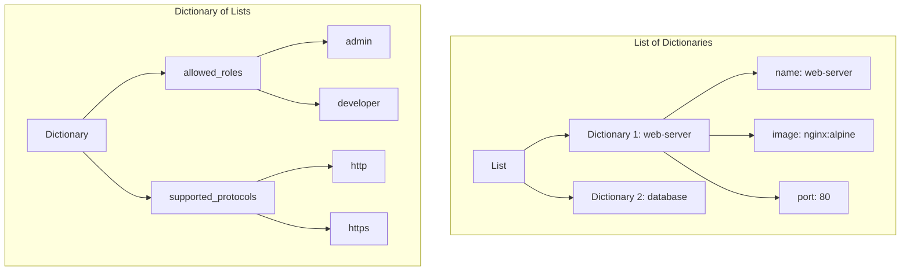
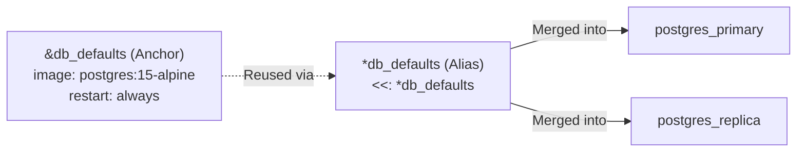

# 🧠 Interactive YAML Masterclass & DevOps Reference Guide

Welcome to the **Interactive YAML Reference Guide**. This document is designed to help you master YAML (YAML Ain't Markup Language) syntax and structures, particularly for DevOps configurations like Docker Compose, Kubernetes, and CI/CD pipelines.

---

## 📋 Table of Contents

- [🧠 Interactive YAML Masterclass \& DevOps Reference Guide](#-interactive-yaml-masterclass--devops-reference-guide)
  - [📋 Table of Contents](#-table-of-contents)
  - [1. Indentation \& Basic Syntax](#1-indentation--basic-syntax)
    - [Key Rules](#key-rules)
  - [2. YAML Strings Demystified](#2-yaml-strings-demystified)
    - [Interactive Showcase](#interactive-showcase)
  - [3. Objects vs Lists](#3-objects-vs-lists)
    - [A. Dictionaries (Mappings)](#a-dictionaries-mappings)
    - [B. Lists (Sequences)](#b-lists-sequences)
  - [4. Nested \& Mixed Structures](#4-nested--mixed-structures)
  - [5. Advanced Features (Anchors \& Aliases)](#5-advanced-features-anchors--aliases)
  - [6. Boolean Gotchas](#6-boolean-gotchas)
  - [7. DevOps Real-World Configurations](#7-devops-real-world-configurations)
    - [Case A: Docker Compose Structure](#case-a-docker-compose-structure)
    - [Case B: Multi-Document Kubernetes Configuration](#case-b-multi-document-kubernetes-configuration)

---

## 1. Indentation & Basic Syntax

YAML is extremely sensitive to structure. It uses spacing to represent data hierarchy.

### Key Rules

> [!IMPORTANT]
>
> - **Case Sensitivity:** YAML is case-sensitive (`ports` is different from `Ports`).
> - **Spaces ONLY:** **NEVER** use tabs for indentation. Doing so will crash your parser immediately.
> - **Spacing after Colons:** Key-value pairs must have a space after the colon: `key: value` (Not `key:value`).

```yaml
# Good Indentation Example (2 Spaces)
indentation_example:
  level_1:
    level_2: "This is indented with 2 spaces under level_1"
    level_2_sibling: "Must align perfectly with level_2"
```

---

## 2. YAML Strings Demystified

YAML gives you multiple ways to write strings, each serving a different purpose:

| String Style             | Syntax Example              | Behavior / Escape Sequences                                     | Best Use Case                                                 |
| :----------------------- | :-------------------------- | :-------------------------------------------------------------- | :------------------------------------------------------------ | ---------------------------- |
| **Bare (Unquoted)**      | `DevOps is awesome`         | Cannot contain special symbols like `:`, `#`, `{`, etc.         | Simple values, labels                                         |
| **Single-Quoted**        | `'This \n will not escape'` | Literal content. Treats `\n` as literal text.                   | Regex patterns, paths                                         |
| **Double-Quoted**        | `"This \n will escape"`     | Processes escape characters (e.g. `\n` inserts a newline).      | Text requiring tabs/newlines                                  |
| **Literal Block (`\|`)** | `                           | ` (followed by lines)                                           | Keeps every newline and trailing whitespace exactly as typed. | Scripts, multi-line commands |
| **Folded Block (`>`)**   | `>` (followed by lines)     | Collapses single newlines into spaces (reads as one paragraph). | Long descriptions, paragraphs                                 |

### Interactive Showcase

<details>
<summary>💡 Click to view the YAML String Examples</summary>

```yaml
strings_showcase:
  bare_string: DevOps is awesome
  single_quoted: 'This \n will not escape to a new line'
  double_quoted: "This \n will escape to a new line"

  # Block Literal (|): keeps every newline exactly as typed
  literal_multiline_script: |
    #!/bin/bash
    echo "Running build step..."
    npm install
    npm run test

  # Block Folded (>): collapses lines into a single paragraph
  folded_multiline_text: >
    This is a very long sentence
    that we want to split across
    multiple lines in our file for
    readability, but we want the parser
    to read it as one single line.
```

</details>

---

## 3. Objects vs Lists

In YAML, you can represent collections of data using either **Dictionaries (Objects)** or **Lists (Sequences)**. Both support **Block Style** (vertical) and **Flow Style** (inline, JSON-like).

### A. Dictionaries (Mappings)

Maps keys to values.

```yaml
# Block Style (Clean & readable)
dictionary_block_style:
  name: "Production Server"
  ip_address: "192.168.1.100"
  status: "active"
  cpu_cores: 4

# Flow Style (JSON-like)
dictionary_flow_style:
  {
    name: "Staging Server",
    ip_address: "192.168.1.101",
    status: "idle",
    cpu_cores: 2,
  }
```

### B. Lists (Sequences)

Ordered collections of items.

```yaml
# Block Style (Uses hyphens)
list_block_style:
  - "nginx"
  - "docker"
  - "kubernetes"
  - "jenkins"

# Flow Style (Uses square brackets)
list_flow_style: ["nginx", "docker", "kubernetes", "jenkins"]
```

---

## 4. Nested & Mixed Structures

Real-world files (especially Kubernetes manifests and Docker Compose files) nest lists within dictionaries, and dictionaries within lists.



```yaml
# A. List of Dictionaries (Very common for container specifications)
list_of_dictionaries:
  - name: "web-server"
    image: "nginx:alpine"
    port: 80
  - name: "database"
    image: "postgres:15"
    port: 5432

# B. Dictionary of Lists (Common for configuration parameters and tagging)
dictionary_of_lists:
  allowed_roles:
    - "admin"
    - "developer"
    - "operator"
  supported_protocols:
    - "http"
    - "https"
    - "grpc"
```

---

## 5. Advanced Features (Anchors & Aliases)

To keep your files **DRY (Don't Repeat Yourself)**, YAML provides **Anchors (`&`)** and **Aliases (`*`)**.

- The Anchor `&` marks a block of code to copy.
- The Alias `*` references and inserts the marked block.
- The Merge Key `<<: *anchor` merges the keys of the referenced block into the current dictionary.



```yaml
# 1. Define the anchor block
defaults_anchor: &db_defaults
  image: "postgres:15-alpine"
  restart: "always"
  environment:
    POSTGRES_USER: "admin"
    POSTGRES_DB: "myapp"

# 2. Inherit and override configs
database_services:
  postgres_primary:
    <<: *db_defaults
    container_name: "db_primary"
    ports:
      - "5432:5432"

  postgres_replica:
    <<: *db_defaults
    container_name: "db_replica"
    environment:
      POSTGRES_USER: "replica_user" # Overrides the default POSTGRES_USER
      POSTGRES_DB: "myapp"
```

---

## 6. Boolean Gotchas

> [!WARNING]
> Different versions of YAML parse booleans differently!
>
> - **YAML 1.1:** Words like `yes`, `no`, `y`, `n`, `on`, `off` are automatically parsed as Booleans.
> - **YAML 1.2:** Only `true` and `false` are recognized as Booleans.
>
> If you are working in DevOps systems (which often use YAML 1.1 parsers), write country codes like `NO` (Norway) or states like `ON` / `OFF` in quotes to prevent them from becoming `false` or `true` values!

```yaml
boolean_comparison:
  unquoted_yes: yes # Evaluates to boolean true in YAML 1.1
  quoted_yes: "yes" # Evaluates to string "yes"
  norway_incorrect: NO # Evaluates to boolean false in YAML 1.1!
  norway_correct: "NO" # Evaluates to string "NO"
```

---

## 7. DevOps Real-World Configurations

### Case A: Docker Compose Structure

A dictionary of services, containing a nested list of ports and volumes.

```yaml
version: "3.8"
services:
  web:
    image: "nginx:latest"
    ports:
      - "80:80"
    volumes:
      - "./html:/usr/share/nginx/html"
    networks:
      - frontend
networks:
  frontend:
    driver: bridge
```

### Case B: Multi-Document Kubernetes Configuration

Use three dashes (`---`) to start a new document context in the same file. This is standard practice in Kubernetes.

```yaml
apiVersion: v1
kind: Service
metadata:
  name: my-web-service
spec:
  ports:
    - port: 80
      targetPort: 8080
  selector:
    app: web
---
apiVersion: apps/v1
kind: Deployment
metadata:
  name: my-web-deployment
spec:
  replicas: 3
  selector:
    matchLabels:
      app: web
  template:
    metadata:
      labels:
        app: web
    spec:
      containers:
        - name: web-container
          image: nginx:1.25.1
          ports:
            - containerPort: 8080
```

---
